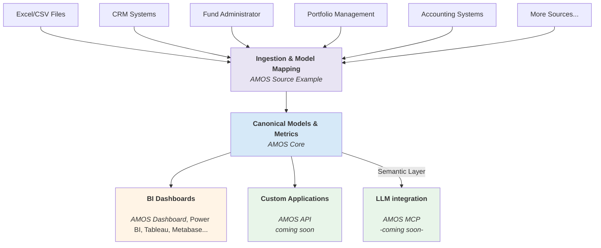

**Amos** | [Core](https://github.com/open-amos/core) | [Dashboard](https://github.com/open-amos/dashboard-example) | [Source Example](https://github.com/open-amos/source-example)

---

# AMOS

The Open-Source Data Backbone for Private Market Funds

  

> AMOS is currently in public beta stage (v0.1.0). Core architecture, models, and patterns are functional but still evolving.  

## What is AMOS?

AMOS —the Asset Management Operating System— is a modern, open-source data stack purpose-built for private markets. It provides both emerging and established funds with the core infrastructure to turn fragmented operational data into a consistent, intelligent foundation for analysis and automation.

AMOS is **open-source**, **cloud- and database-agnostic**, and **vendor-independent**, giving funds full control of their architecture while enabling shared data standards across the industry. 

## Who It’s For

- **Emerging funds** looking for a lightweight but robust data foundation to support efficient operations, reliable reporting, and AI-readiness from day one  
- **Established funds** seeking to modernize legacy systems and simplify complex data architectures without vendor lock-in

## Quick Start

1. Install [dbt](https://docs.getdbt.com/docs/get-started-dbt) 
2. Configure your database connections in your dbt `profiles.yml` file
3. Git clone this repository
4. Run `dbt deps` to install the dependencies
5. Run `dbt seed` to load the example data
6. Run `dbt run` to build the models
7. Run `dbt test` to run the tests

## Project Components

We split the project into modular components to ensure flexibility.

| Repository | Purpose | Who is this for? |
| :--- | :--- | :--- |
| **AMOS** | **The Product.** Contains the installer, Docker setup, and documentation. | **Everyone starts here.** |
| **[AMOS Core](https://github.com/open-amos/amos-core)** | **The Brain.** The dbt models and SQL logic that power the platform. | Data Engineers extending the logic. |
| **[AMOS Dashboard](https://github.com/open-amos/amos-dashboard)** | **The UI.** A reference implementation of a BI dashboard for private markets. | Frontend devs & UI customizers. |
| **[AMOS Source Example](https://github.com/open-amos/amos-source-example)** | **The Template.** Example data loaders and transformation patterns. | Engineers building new integrations. |

## System Architecture

## Demo

Explore a dashboard demo built with AMOS Core, AMOS Source Example and AMOS Dashboard.
[→ demo.amos.tech](https://demo.amos.tech)

## Current Scope

AMOS currently supports core private markets use cases and data sources:

- Canonical model and base metrics for **Private Equity** and **Private Credit** workflows  
- Integration patterns for key systems: **deal pipeline**, **portfolio management**, **fund administration**, and **accounting**

The existing components provide a functional foundation for consolidating and analyzing fund, portfolio, and deal data in a unified way.

## Roadmap

AMOS is evolving toward broader coverage across asset classes and workflows. Upcoming milestones include:

- Additional models and metrics for **ESG**, **impact measurement**, and for other asset types  
- Extended data connectors and transformation patterns  
- A public **REST API** for external programmatic access  
- **MCP server integration** for AI assistants and notebooks  
- Prebuilt **dashboards** and **utility apps** for reporting, reconciliation, and data management

## Customization and Extensibility

## Customize

AMOS is built to be extended. You can:

- **Connect real data sources** - Replace AMOS Source Example with your own sources and map them to AMOS Core
- **Extend AMOS Core** - Add custom dimensions, facts, or metrics (in separate packages) 

To maintain upgrade compatibility, avoid editing the AMOS Core directly. Instead, you should develop your own packages upstream or downstream of AMOS Core, using the models in **AMOS Source Example** and **AMOS Core** as templates.

## Licensing

AMOS is currently in public preview.
Each subproject README describes its temporary licensing terms.
Final open-source or source-available licenses will be published before the 1.0 release.
